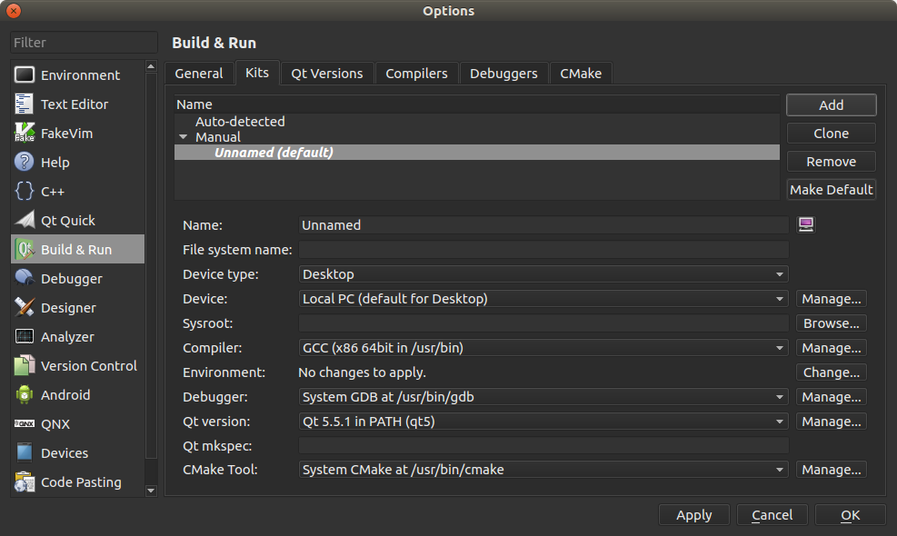
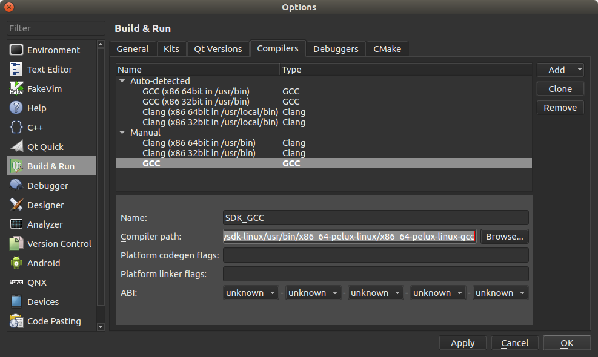
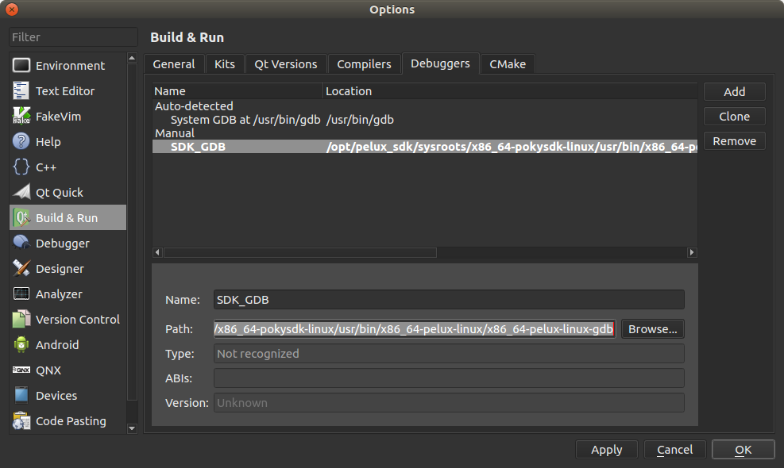
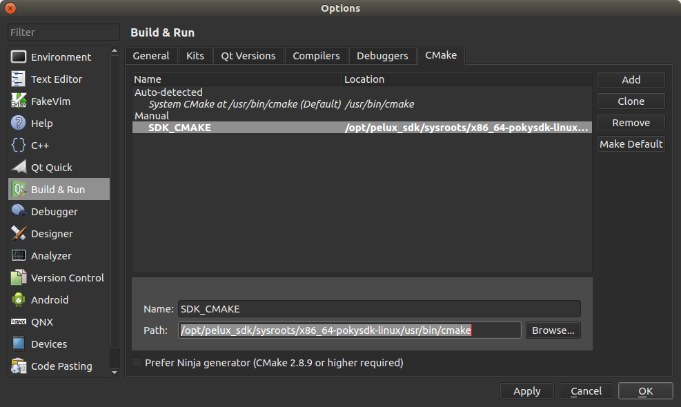
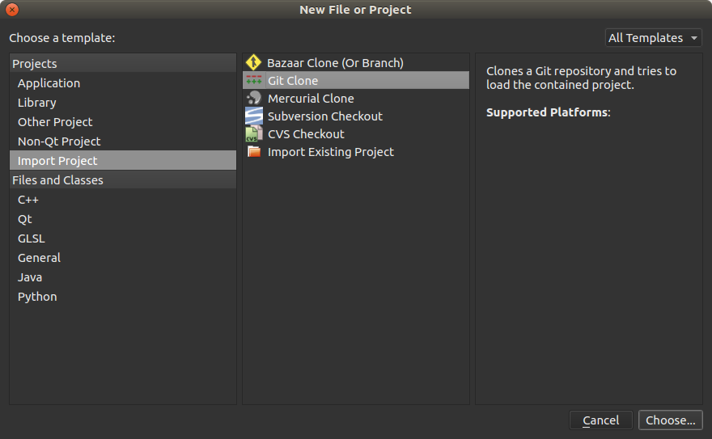
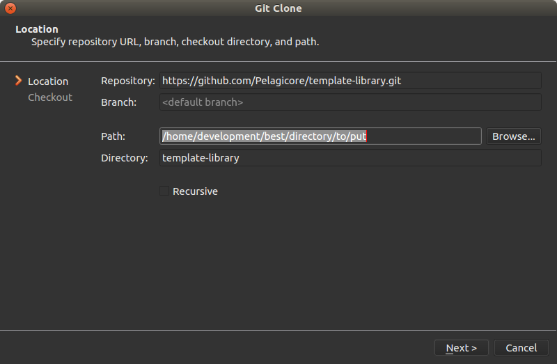

:orphan:

Configuring QtCreator to use the SDK
====================================

After :ref:`the installation of the SDK <installing-sdk>` and :ref:`sourcing the
environment <sourcing-the-environment>`, there are a couple of steps needed to
run QtCreator in the SDK environment. This roadmap assumes that the SDK and
QtCreator are installed and the environment is ``source``\d already.

Adding a new kit
----------------

To be able to cross-compile via QtCreator, a new build kit should be added to build
setup to QtCreator.

* Open QtCreator
* Open Options form from Tools->Options, then click ``Build & Run`` in the left
  panel of the option window.
* Select the ``Kits`` tab and click the ``Add`` button.

* Name your new kit and as ``Device type`` choose ``GenericLinuxOsType``.
* Then browse and select the path to the sysroot. If you don't know the sysroot
  location you can find it by typing ``echo ${SDKTARGETSYSROOT}`` to the terminal.
  Please note that the terminal should be ``source``\d beforehand.
* Then choose a C compiler. If the cross compiler of the SDK is not listed, it should
  be added as a new gcc. To add a new gcc click the ``Manage`` button next to compiler.
  Add your GCC path here. You can find this path in the environment as well.
  To do so, type ``which ${CC}`` in your terminal. Please note that the terminal
  should be ``source``\d beforehand.

* Choose the C++ compiler as you did in the previous step. You can find the path by
  typing ``which ${CXX}`` to the terminal. Please note that the terminal should be
  ``source``\d beforehand.
* Copy the environment list of the SDK to ``Environment``. You can find the environment
  list by typing ``env`` to the terminal.
* Choose ``Debugger``, if it is not listed in the drop down menu click the ``Manage..``
  and add a new Debugger. You can find the debugger path with command ``which $GDB``.
  Please note that the terminal should be ``source``\d beforehand.

* Choose CMake Tool, if it is not listed in the drop down menu click the ``Manage..``
  button and add the path to CMake. You can find the path to Cmake with ``which cmake``.
  Please note that the terminal should be ``source``\d beforehand.

* If you are working with qmake then it should be added as well. You can find
  the path to qmake with ``which qmake``. Please note that the terminal should be
  ``source``\d beforehand.
* Add ``CMAKE_SYSROOT:STRING=<sysroot path>`` item to the ``CMake Configuration``
  list. You can find the path to the sysroot with ``echo ${SDKTARGETSYSROOT}``.
  Please note that the terminal should be ``source``\d beforehand.

How to open the template service project with QtCreator
-------------------------------------------------------

* Open QtCreator
* From the ``File`` menu choose ``New File or Project``

* Select ``Import Project`` from the ``Projects`` section
* Click ``Git Clone`` and then click the ``Choose`` button

* In the window, which just opened, add the repository to the ``Repository section``.
  The git repo for the ``template-library`` is https://github.com/Pelagicore/template-library
* Select a proper path and add it to the ``Path`` section, then click ``Next``
* QtCreator will clone the project, then click ``Finish``
* Here you should select the kit to use to build project
* Select the kit you have already created in the previous step and click ``Configure``

.. tags:: howto
